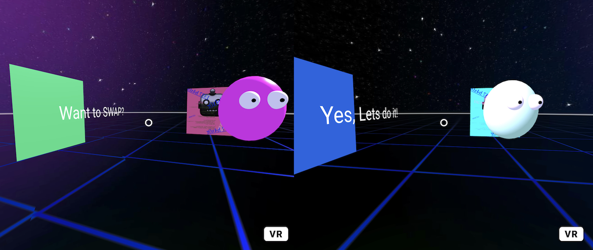
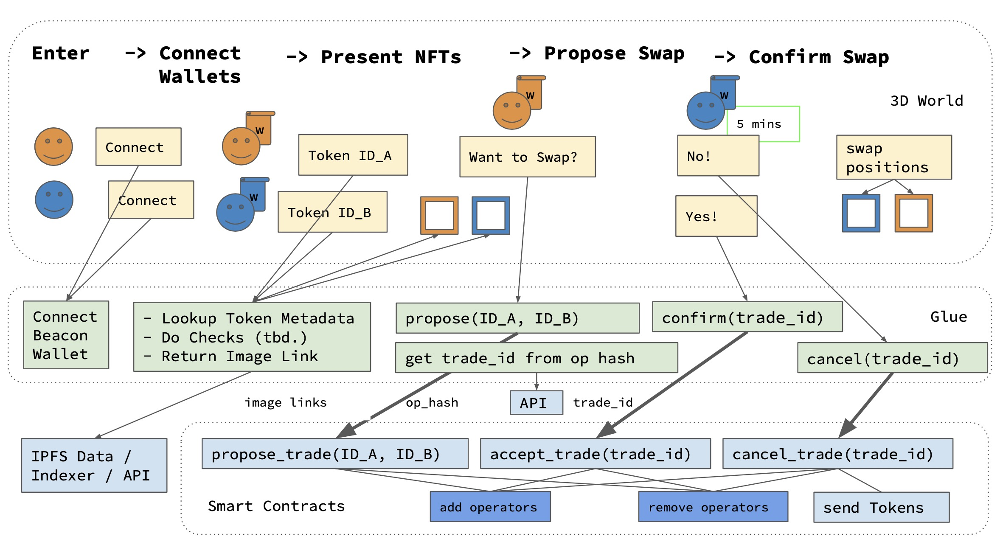

# the swap

 Note (Feb. 2023) this code is outdated and needs a rewrite. 

**A playful interaction in the metaverse. A first step into the swappyverse.**

The Swap is a playful interacion inside a micro-metaverse - a tiny 3D world built with WebXR and backed by a custom smart contract on the green [Tezos](https://tezos.com/) blockchain. It lets two players exchange (swap) a pair of NFTs. 

### Background

When I first read the word "swap" on Hic et Nunc, I imagined two people exchchanging NFTs. However, I learned that "swapping" means preparing the NFT for sale, after minting it. When you "swap", you declare the price of the NFT and send it into the contract. Then someone else can collect it.

A bit later I came across an event called #OBJKT4OBJKT, organized by [diversenft](https://diversenft.art/), where artists all over the world would actually swap or give their NFTs for (almost) nothing. This was the spirit of exchange I had been looking for and it has touched many of us that took part and beyond.

I wanted to bring that spirit to our metaverse, which is a different concept what people have heard from big corporations. I am preparing a series of tutorials and implementing "the swap" was to be one of them. When I heard that Javier was already writing contracts that do swap in the literal sense I was looking for, I asked him to team up and write a contract specifically for the "Game On! Tezos" hackathon. 

Here is the schema that shows how it works:

### How to use - for development and testing 

*The swap is currently work in progress. A bug in the logic prevents player 1 from confirming operations (see below). For development and testing (runs on the Hangzhounet Testnet) but not for production yet. - see roadmap below.*

Dependencies: [node.js](https://nodejs.org/en/), two Tezos accounts on Hangzhounet Testnet

To install dependencies, run: `npm install`.
Then run: `npm run watch`. This auto-generates the output in `dist`.
To serve the folder `dist`, then run: `npm run start`. 

For local testing, you can control both players:

1. Open http://localhost:8080/. Both player views are shown side by side in two iFrames within one browser window. Click in one frame then move the player. 
2. When the two wallet connections pop up, connect **two different accounts on the Hangzhounet Testnet**.

The two NFTs we minted on Testnet as SWP Tokens are also available as HEN OBJKTs on Mainnet, created for developing and testing web 3 applications: 

* pink: https://hicetnunc.art/objkt/589276
* cyan https://hicetnunc.art/objkt/589279 

To host on a public server, follow the advice here: 
https://github.com/networked-aframe/networked-aframe/blob/master/docs/hosting-networked-aframe-on-a-server.md

You can watch the transactions on the contract here: https://hangzhou2net.tzkt.io/KT1LZR4wt2Ws27jKqmhviQxLgJfSkve94VwX/operations/

See also "the swap - presentation.pdf" in folder docs. For contract adresses: see Readme.md in folder smart-contracts.

### Libraries / Frameworks / Tools: 

* [A-Frame](https://aframe.io/)
* [Networked A-Frame](https://github.com/networked-aframe/networked-aframe)
* [Taquito](https://tezostaquito.io/)
* [Parcel](https://parceljs.org/)
* [SmartPy](https://smartpy.io/)

## Autobahnmap of To-Dos
## Stage 1 
**Goal: Implement a MVP /Proof of Concept on Testnet**

### To Dos
[X] Write custom Smart Contract in SmartPy and deploy on Testnet       
[X] Mint Tokens for testing (Testnet)    
[X] Set up development pipeline    
[X] Create elements and environment in minimum 3D world (A-Frame)
[X] Set up networked component (Networked A-Frame)   
[X] Implement glue layer for contract calls in Taquito    
[X] Show Wallet Account IDs   

### Bugs
[ ] Player one cannot confirm transactions - their Wallet aborts     

### Nice To Have

### To be discussed
[ ] buttons: local colors should update as well, in addition to remote colors (bug or feature?)

## Stage 2
**Goal: Move fuctionality to Mainnet and implement HEN OBJKTs**

### To Dos
[ ] Get Trade ID from FxHash  
[ ] Implement UI to enter Token IDs
[ ] Get IPFS link from Token ID (Mainnet)    
[ ] Create branches for iFrames vs. separate Windows
[ ] Add calls to explicitly update operators (currently handled manually)

[ ] Check Player IDs in contract to enforce operation 

[ ] Visualize swap
[ ] Sonify swap
[ ] Offer different evironments as templates 

[ ] Host a public instance     
[ ] Configure Networked A-Frame to support streaming audio    
[ ] Move to Mainnet    
[ ] Get security audit
[ ] Write Unit Tests
[ ] Conduct Private and Public Betatesting

## Stage 3
**Goal: Support more interactions and other token types**

[ ] Add VR controller Interaction    
[ ] Swap in AR    
[ ] So much more    

---    

Made by [@jagracar](https://twitter.com/jagracar) (smart contracts) and [@crcdng](https://twitter.com/crcdng) (interaction / api).

MIT License. See copyright notice -> LICENSE. Note that this license requires attribution and that it excludes any warranty.
